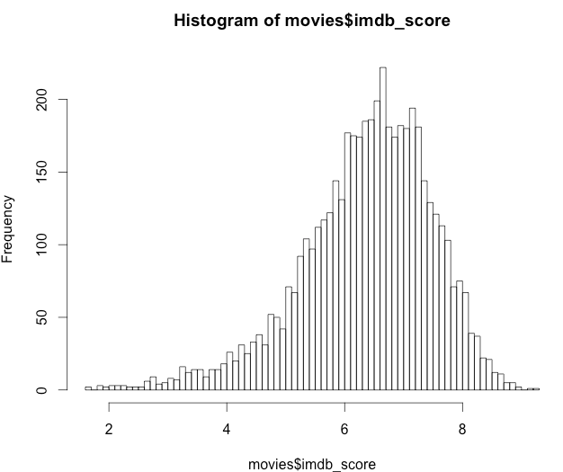
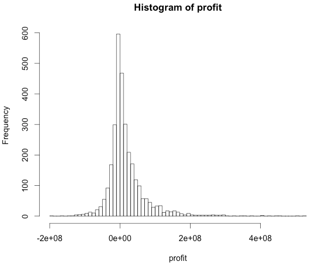
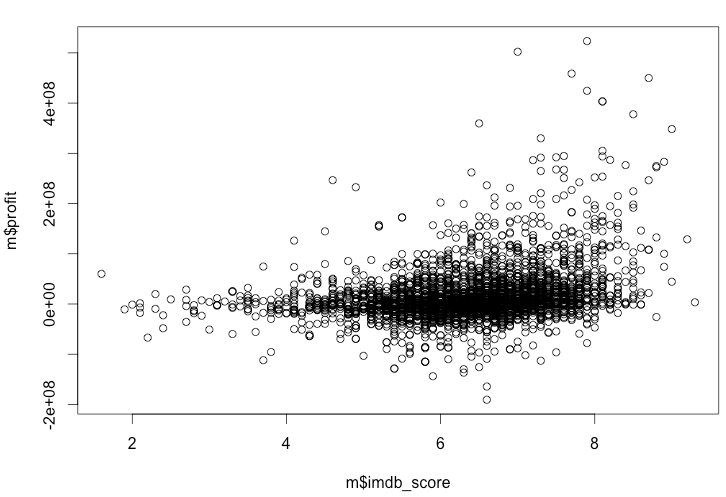

# Аналіз рейтингу фільмів

Вибраний набір даних для аналізу: https://www.kaggle.com/carolzhangdc/imdb-5000-movie-dataset/data#
Аналіз буде корисний для тих, хто хотів би зняти свій фільм. Аналіз допоможе прорахувати ризики залежно від бюджету.


#### Завантажимо файл та зчитаємо метадані фільмів з нього:

```r
> movies <- read.csv(“movie_metadata.csv”, stringsAsFactors = TRUE)
```

#### Перевіримо те, що оцінка фільму говорить багато про нього. Для цього побудуємо гістограму оцінок для усіх фільмів

```r
> hist(movies$imdb_score, 100)
``` 


#### Далі визначимо, яку оцінку повинен отримати фільм, щоб увійти у топ-10 % всіх фільмів

```r
> quantile(movies$imdb_score, probs = 0.90, na.rm = TRUE)
7.7
```

#### Тепер визначимо рентабельність фільмів

```r
> summary(movies$budget)
Min.         1st Qu.    Median      Mean   3rd Qu.      Max
218000000   6500000  20000000  35870000  50000000 300000000

> summary(movies$gross)
Min.         1st Qu.    Median      Mean   3rd Qu.      Max.      NA's 
162000000  10110000  32180000  55210000  72150000 760500000       512
```

Бачимо, що діапазон бюджетів - 218-300 млн дол.
А діапаозн прибітку - 162-760 млн дол.

#### Побудуємо гістограму прибутковості фільмів

```r
> profit <- movies$gross — movies$budget
> hist(profit, 100)
``` 



#### Проведемо кореляцію між тим, чи пов'язана оцінка фільму з його прибутковістю

```r
> cor(movies$imdb_score, movies$profit, use=”complete.obs”)
[1] 0.2949907
```



### Висновки

1. Бюджет фільму не впливає на прибуток напряму
2. Бюджет фільму не впливає на оцінку фільму напряму
3. Оцінка фільму глядачів та його прибутковість прямопропорційні